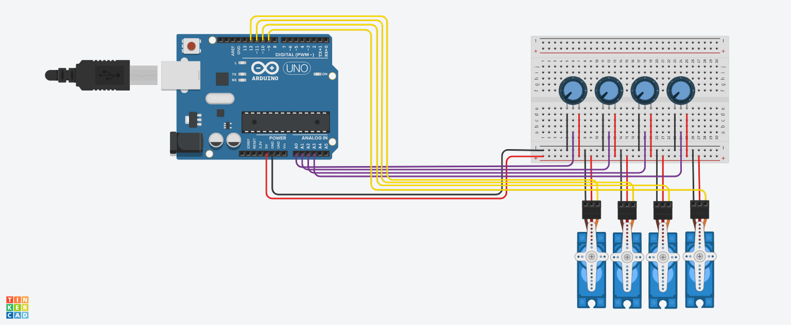
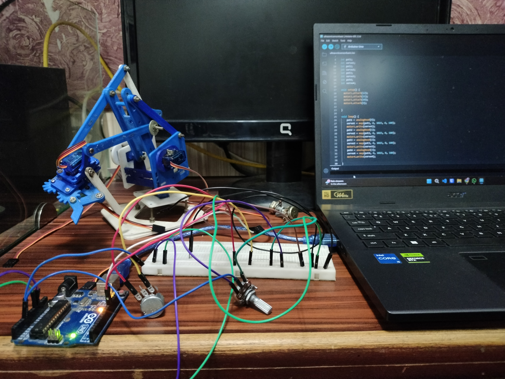

# 🤖 Robot Arm Control using Arduino Uno and Potentiometers

This project demonstrates how to control a 4-degree-of-freedom robot arm using **Arduino Uno** and **four potentiometers**. Each potentiometer adjusts one servo motor.

---

## 🧠 How It Works

- Potentiometers send analog values to the Arduino.
- Arduino maps those values to servo angles (0°–180°).
- Servos move the robot arm accordingly.

---

## 🔧 Components Used

See [`components.txt`](./components.text) for the full list.

---

## 🔌 Circuit Diagram

Below is the wiring schematic for this project:

---

## 💾 Arduino Code

All code is in the file: [`robot_arm_control.ino`](./robot_arm_control.ino)

---

## 📸 Demo

